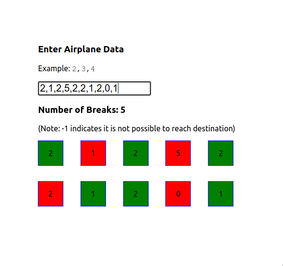

# Break Counter

This project was bootstrapped with [Create React App](https://github.com/facebook/create-react-app).

## Install

`npm install` or `yarn`

## Run

`npm run start` or `yarn start`

## Screenshots

## Note

Number of breaks is 1 less than the value displayed in UI. The value actually indicates number of planes to be changed to reach the destination. I could have subtracted 1 but that would have not matched the expected answers for the test.
